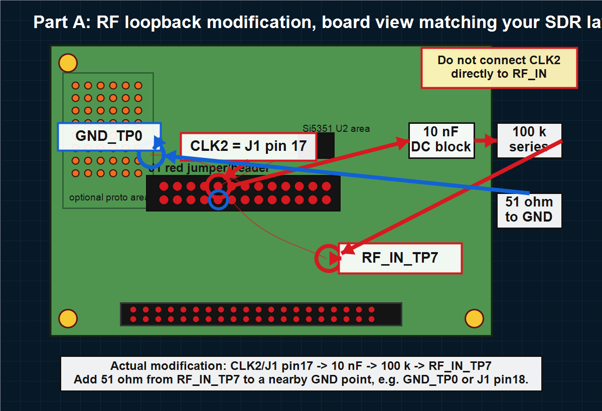
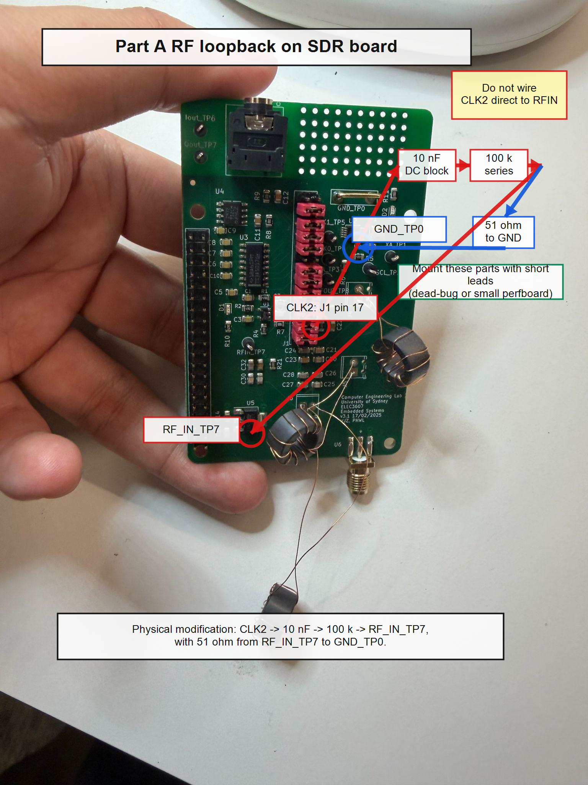

# Part A 硬件修改说明：CLK2 到接收机输入的 RF 环回

本修改的目的，是把 Si5351 的空闲输出 `CLK2` 当作 WSPR 发射机的 RF 输出，并把它用硬线方式接回原 SDR 接收机输入。这样测试时信号没有通过天线发射，而是在板上完成 RF loopback，符合题目要求。

## 修改位置示意图

下图按 KiCad/SDR 板布局方向标注，和我们板子的截图方向一致。红色是 RF 信号路径，蓝色是接地/终端路径。

下面这张是基于 lab book 中 SDR 板照片的实物辅助标注，可用于说明实际飞线位置。

## 为什么要这样改

1. **使用 `CLK2` 是因为它是 Si5351 的剩余时钟输出。** 原来的 SDR 接收机已经使用其他 Si5351 输出产生 mixer clock；`CLK2` 没有被接收链路占用，所以可以由发射程序单独控制，产生 WSPR 的四个 FSK tone。

2. **必须做 RF 环回，而不是空中发射。** 作业要求 transmitter output looped back to receiver input at radio frequency and hardwired。也就是说，输出应该接到接收机 RF 输入点，而不是接天线，也不是只在音频端注入。

3. **不能把 `CLK2` 直接接到 `RF_IN_TP7`。** `CLK2` 是 3.3 V CMOS 方波，幅度远大于接收机正常接收的微弱 RF 信号。若直接连接，接收机前端会严重过载，可能导致 mixer/baseband 饱和，WSPR decoder 反而解不出来。

4. **`100 kΩ + 51 Ω` 形成一个简单衰减器。** 输出节点接 `51 Ω` 到地，前面串 `100 kΩ`，电压衰减约为：

   `20 log10(51 / (100000 + 51)) = -65.9 dB`

   这会把 Si5351 的强 CMOS 输出降低到接收机可以处理的强 RF 测试信号范围。

5. **`10 nF` 电容用于隔直。** 它阻断 `CLK2` 的 DC 电平，只让 RF/FSK 交流分量进入接收机输入，避免把 Si5351 的直流偏置硬接到接收机前端。

## 实际焊接步骤

1. 在红色 J1 跳线排上找到 `J1 pin 17`，这是 `CLK2`。建议焊接前用 KiCad 原理图/PCB 或万用表连通性确认一次。

2. 从 `J1 pin 17 / CLK2` 拉一根短线，到 `10 nF` 串联电容的一端。

3. `10 nF` 的另一端接 `100 kΩ` 串联电阻。

4. `100 kΩ` 的另一端接到 `RF_IN_TP7`。这里就是原 SDR 接收机的 RF 输入测试点。

5. 在 `RF_IN_TP7` 同一个节点，再接一个 `51 Ω` 电阻到 `GND_TP0`。也可以接到 `J1 pin 18`，因为它同样是 GND。

6. 所有连线尽量短。元件可以用 dead-bug 方式固定，也可以焊在板上的小孔洞区，再用短线连到 `CLK2`、`RF_IN_TP7` 和 `GND_TP0`。

## 调试建议

先不要接天线。运行发射程序后，用示波器或频谱仪确认 `CLK2` 有 WSPR tone，然后再看 `RF_IN_TP7` 的电平。如果接收机过载或解码失败，先把 `100 kΩ` 改成 `220 kΩ`；如果信号太弱，可以尝试 `47 kΩ`。报告里应记录最终电阻值、测得的 RF 电平，以及 WSPR decoder 是否能解出 callsign/grid/power。
